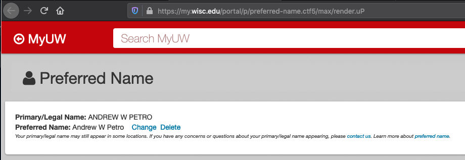
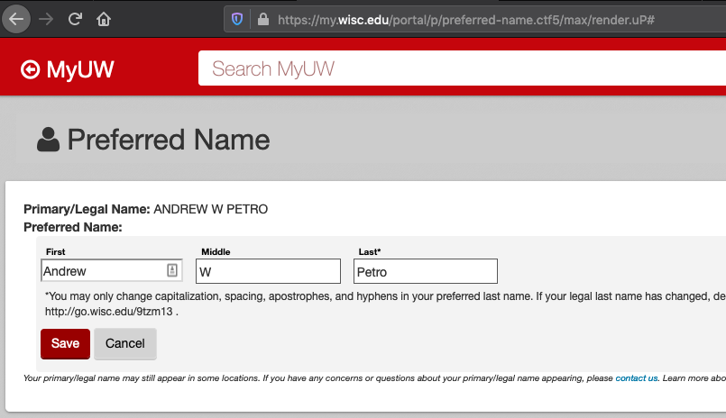
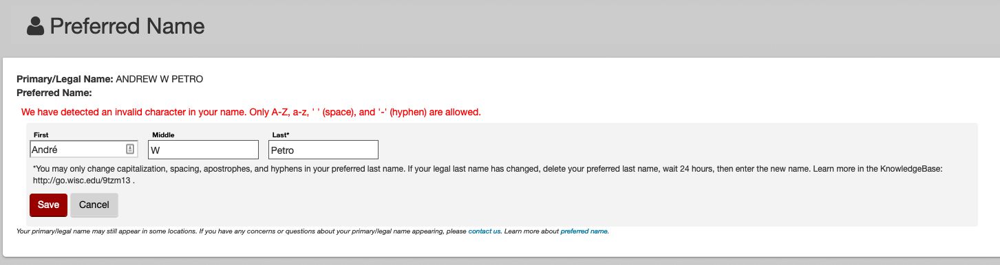
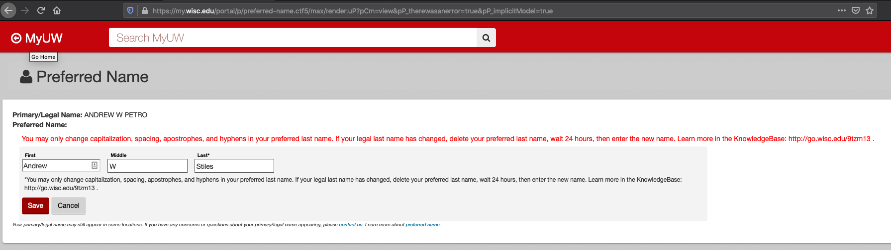
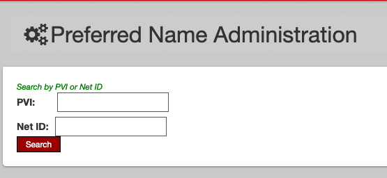
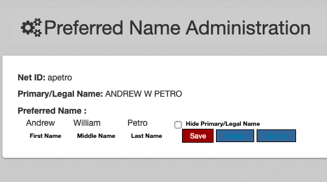
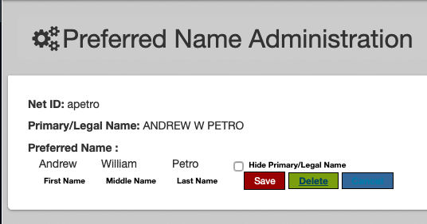

# Name in Use

Previously known as Student Preferred Name Portlet.

## Not just for students

There's nothing specifically "student" about the Preferred Name Portlet except
that was its original name and branding.
It continues to be available to students in MyUW as [Student Personal Information][], though the only "personal information" it shows is system-of-record-name and name-in-use.
The identical code is also published under the name [Preferred Name][]
and available to a wider audience including staff.
Historically the staff-only [Madison "Personal Information" portlet][]
in the HRS suite
included another implementation of preferred name viewing and editing,
but in modern MyUW Personal Information displays preferred name to Madison users
but hyperlinks to Preferred Name for preferred name editing.

While Madison and System "Personal Information" are the same source code,
they respond differently to Madison vs System identity information such that
"Personal Information" only provides a UI for preferred name for
Madison users.

## Architecture

The Preferred Name Portlet provides the user interface for eligible users to
view and modify their "preferred name" on a self-service basis. The Portlet
connects to back-end systems from CIAM to read and write this data. The Portlet
holds no data -- it is only an interface for viewing and modifying CIAM data.

## End-User interface

Preferred Name shows the user their current system-of-record name and their
preferred name, if any.



Users can "Change" or "Delete" their preferred name.

"Change" opens a form.



From the form, users can edit their preferred name.

### Preferred name form validation

There's some form validation. Exactly what validation depends on [feature flags](https://git.doit.wisc.edu/wps/myuw-service/myuw-legacy/legacy-portals/-/feature_flags).

Always:

+ No part of the name (first, middle, or last) can be more than 30 characters.
+ *Preferred first name is required*, if there's a preferred name at all.

#### Character set validation

If the `preferred-name-allow-latin9` feature flag is *not* set,
the preferred name form limits preferred names to the characters
A-Z, a-z, single quote (`'`), hyphen (`-`), and space (` `).
This excludes accented characters. (This is the historical behavior of preferred name).




If the `preferred-name-allow-latin9` feature flag *is* set,
the preferred name form limits preferred names to the [LATIN-9 character set](https://en.wikipedia.org/wiki/ISO/IEC_8859-15).
In general this supports many but not all accented characters.

#### Validating preferred last name similarity to legal last name

If the `preferred-name-allow-any-last-name` feature flag is *not* set,
the preferred name form attempts to require that the preferred *last name* be very similar to the legal last name.
What "similar" means depends upon which character set is in use. Enforcing last name similarity in the form is the historical behavior.

When *not* supporting Latin-9,
similarity means differing only in capitalization,
adding or removing spacing, adding or removing single quotes, and adding or removing hyphens.



When supporting Latin-9, all those differences are allowed,
and additionally plausible accents and some transliteration of digraphs are supported.
For example, a person with a legal last name of NUNEZ could prefer last name Nuñez.
A person with legal last name FRANCOIS could prefer last name François.
The validator also attempts to honor things like German `ß` can be transliterated as `ss` or as `sz`.
This validator is imperfect and should be enhanced as real world cases arise that it does not correctly support.

If the `preferred-name-allow-any-last-name` feature flag *is* set,
the form does not check for similarity between preferred and legal last names.

When the Portlet validates proposed name-in-use last name against system of record last name, it is using the value of LDAP attribute `wiscEduSORLastName` as the last name to validate against.

In `PersonalInformationController.java`:

```java
  @ActionMapping(params = "action=savePreferredName")
    public void submitEdit(ModelMap modelMap, ActionRequest request, ActionResponse response,
        PreferredName preferredName, BindingResult bindingResult) throws PortletModeException {
// ...
        String legalLastName = userInfo.get("wiscEduSORLastName");
        PreferredNameExtended pne = new PreferredNameExtended(preferredName, legalLastName);
// ...
            ValidationUtils.invokeValidator(new Latin9LastNameSimilarValidator(), pne, bindingResult);
// ...
        }
```

`userInfo.get(wiscEduSORLastName")` gets `wiscEduSORLastName` as mapped into the Portlet from the Portal user attribute.

In `portlet.xml`:

```xml
    <user-attribute>
        <name>wiscEduSORName</name>
    </user-attribute>
```

MyUW reads that user attribute from LDAP.

In [MyUW LDAP configuration][]:

```xml
<!-- ... -->
<bean class="org.jasig.services.persondir.support.ldap.LdapPersonAttributeDao">
  <!-- ... -->
  <property name="resultAttributeMapping">
    <map>
      <!-- ... -->
      <entry key="wiscEduSORName" value="wiscEduSORName"/>
```

## Admin interface

There's an administrative interface whereby authorized administrators can
look up the preferred name of a person by NetID or by PVI.



The administrative interface is *not* an interface for setting the user's
preferred name. The concept is that preferred name is self-service and only
users can choose their own preferred name.



In the administrative interface, an administrator can delete a preferred name.



Administrators can also toggle whether to hide the primary/legal name (in directory search results?)

Administrators [set the self-service form validation feature flags in git.doit](https://git.doit.wisc.edu/wps/myuw-service/myuw-legacy/legacy-portals/-/feature_flags),
not directly in this within-MyUW administrative interface.

## Guts

In `portlet.xml`, the portlet maps in several user attributes from the portal.

```xml
   <user-attribute>
     <name>eppn</name>
   </user-attribute>
   <user-attribute>
        <name>sn</name>
    </user-attribute>
    <user-attribute>
    	<name>wiscedupvi</name>
    </user-attribute>
    <user-attribute>
        <name>wiscEduSORName</name>
    </user-attribute>
    <user-attribute>
    	<name>wiscedupreferredname</name>
    </user-attribute>
    <user-attribute>
    	<name>wiscedupreferredmiddlename</name>
    </user-attribute>
    <user-attribute>
    	<name>wiscedupreferredfirstname</name>
    </user-attribute>
```

It includes `eppn` (EduPersonPrincipalName -- these look like email addresses) as the user identifier when computing applicability of form validation feature flags.
That is, the feature flags can be narrowly targeted to specific eppns.


It uses other attributes to compute whether there's a pending preferred name change

```java
  String currentFirstName = userInfo.get("wiscedupreferredfirstname");
  String currentMiddleName = userInfo.get("wiscedupreferredmiddlename");
  //wiscedupreferredlastname is not currently populated
  String currentLastName = userInfo.get("wiscedupreferredlastname");
  ...
  modelMap.addAttribute("pendingStatus", preferredNameService.getStatus(
    new PreferredName(currentFirstName, currentMiddleName, currentLastName, pvi)));
```

That is, the portlet detects a difference between the preferred name coming through user attributes
and the preferred name read from the preferred name database, and uses that difference to
indicate to the user whether there's an in flight preferred name change.

It also uses these attributes to initialize the portlet

```java
  modelMap.addAttribute("sirName", userInfo.get("sn"));
  modelMap.addAttribute("legalName", userInfo.get("wiscEduSORName"));
```

 for render.

```jsp
  <div class="contact-info-official-name">
    <span class="uportal-channel-strong"><spring:message code="label.official.name"/>:</span>
    <span>${legalName}</span>
  </div>
```

That is to say, the user attribute `wiscEduSORName`
renders on the page as the apparent legal name.

The user attribute `sn` displays as the status quo preferred last name,
unless there's a last name from a status quo preferred last name.

(Some of this complexity looks like working around
not getting the preferred last name via user attribute
at the time the Portlet was developed.)

The Portlet reads preferred name using a SQL query against `msnprefname.msn_preferred_name`.

The Portlet updates preferred name using stored procedure `msnprefname.LOAD_PREFERRED_NAME`.

Showing and hiding preferred name via the admin interface
invokes the `msnprefname.UNHIDE_SOURCE_NAME` and `msnprefname.HIDE_SOURCE_NAME`
stored procedures, respectively.

[Student Personal Information]: https://my.wisc.edu/web/apps/details/StudentPreferredName
[Preferred Name]: https://my.wisc.edu/web/apps/details/preferred-name
[Madison "Personal Information" portlet]: https://my.wisc.edu/web/apps/details/contact-information

[MyUW LDAP configuration]: https://git.doit.wisc.edu/myuw/uPortal/-/blob/uw-master/uportal-war/src/main/resources/properties/contexts/personDirectoryContext.xml#L407
